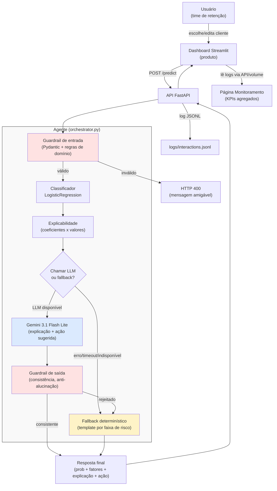

# Diagrama de Arquitetura

## Componentes

| Componente | Papel |
|---|---|
| **Dashboard Streamlit** | Produto — interface para escolher/simular um cliente e visualizar o resultado do agente. |
| **API FastAPI** | Contrato entre produto e agente — expõe `POST /predict`, `GET /health`, `GET /customers/sample`. |
| **Guardrail de entrada** | Valida schema (Pydantic) e regras de domínio (ex: coerência `InternetService`) antes de processar. |
| **Classificador (LogisticRegression)** | Prevê a probabilidade de churn a partir do perfil do cliente. |
| **Explicabilidade** | Extrai os fatores mais influentes via coeficientes do modelo ponderados pelos valores do cliente. |
| **Gemini (LLM)** | Gera explicação em linguagem natural e ação de retenção a partir do contexto pré-computado. |
| **Guardrail de saída** | Rejeita respostas vazias, contraditórias com a probabilidade, ou com fatores não fornecidos (alucinação). |
| **Fallback determinístico** | Substitui o LLM quando indisponível/rejeitado — sem chamada de rede, sempre disponível. |
| **Logs (JSONL)** | Registro estruturado de cada interação — alimenta a página de Monitoramento. |

## Fluxo de dados

1. Usuário escolhe um cliente (da base ou manual) no dashboard.
2. Dashboard envia `POST /predict` para a API com o perfil do cliente.
3. API valida a entrada (guardrail) e, se válida, invoca o orquestrador do agente.
4. Orquestrador roda o classificador, extrai os fatores, e decide chamar o LLM.
5. Se o LLM responder de forma consistente (guardrail de saída), essa resposta é usada;
   caso contrário (erro, timeout, ou rejeição), o fallback determinístico assume.
6. API registra a interação em log estruturado e devolve a resposta ao dashboard.
7. Dashboard exibe probabilidade, fatores, explicação, ação sugerida e avisos (fallback/latência).
